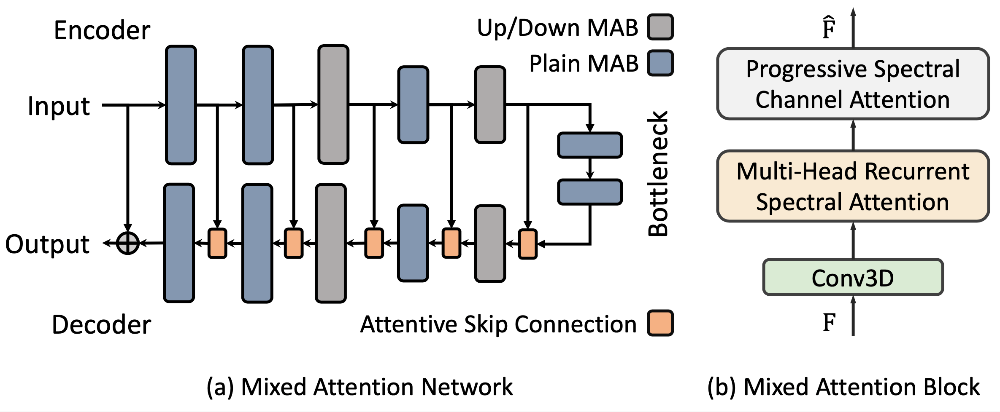
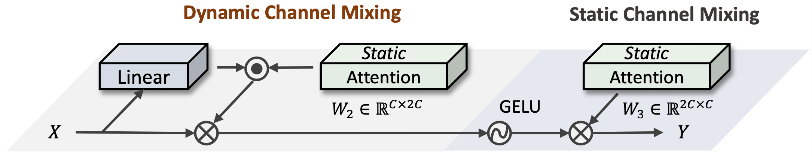
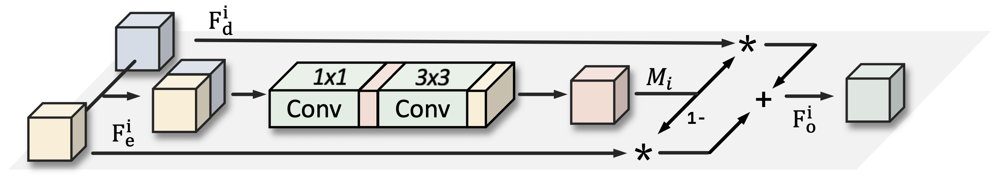
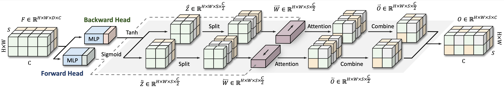
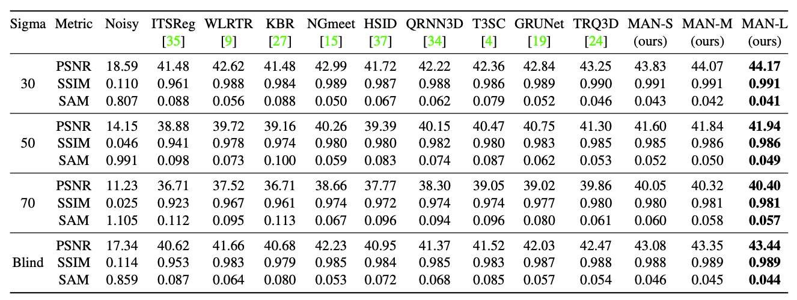
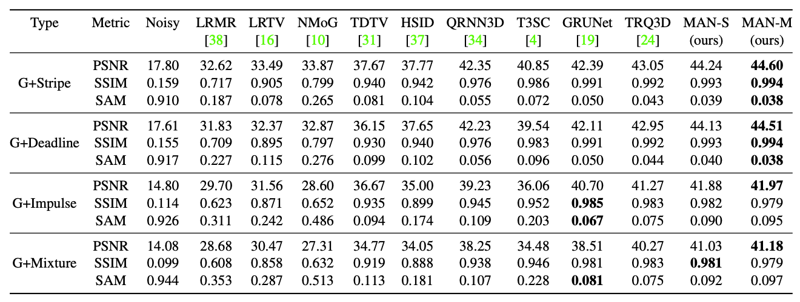
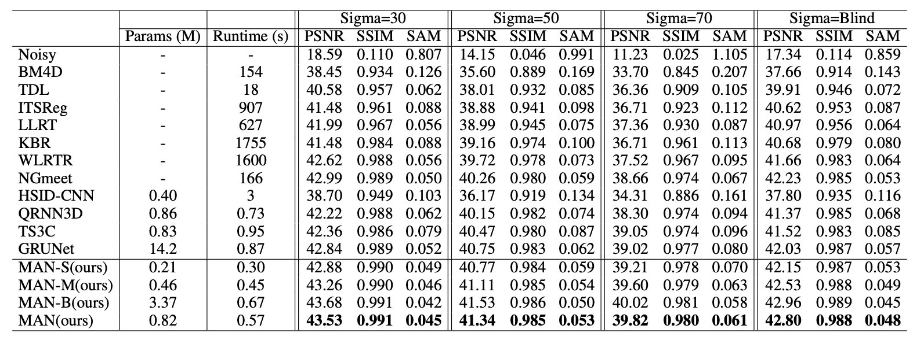
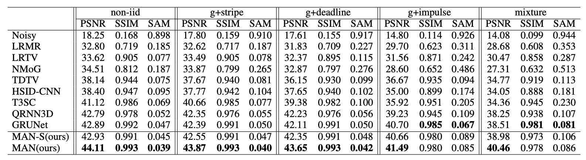

# MAN

> 🌟🌟 Checkout our new work [HSDT](https://github.com/Zeqiang-Lai/HSDT), a superior HSI denoising transformer.
  
Official PyTorch Implementation of [Mixed Attention Network for Hyperspectral Image Denoising](http://arxiv.org/abs/2301.11525).

*Zeqiang Lai, Ying Fu*.

| <sub><sup>Overall Architecture</sup></sub> | 
| ------------------------------------------ | 
|  |

🌟 **Hightlights**

- We propose a "*Mixed Attention Network*" for hyperspectral image denoising.
- We introduce a "*Multi-Head Spectral Recurrent Attention*" block to aggregate the *inter-spectral* features.
- We introduce a "*Progressive Channel Attention block*" for integrating the *intra-spectral* features.
- We introduce an "*Attentive Skip Connection*" to strengthen the important features from *low-* and *high-level*.


<details>
<summary>Illustrations of each network components.</summary>
<br/>

| <sub><sup>Progressive Spectral Channel Attention</sup></sub>  | <sub><sup>Attentive Skip Connection</sup></sub>           |
| ----------------------------------------- | ---------------------------------------- |
|  |  |

<table >
    <thead>
        <tr>
			<th> <sub><sup>Multi-Head Recurrent Spectral Attention</sup></sub> </th>
		</tr>
    </thead>
	<tbody>
		<tr>
			<td>  </td>
		</tr>
	</tbody>
</table>
</details>


## Usage

Download the pretrained model at [Github Release](https://github.com/Zeqiang-Lai/MAN/releases/latest).

- Training, testing, and visualize results with [HSIR](https://github.com/bit-isp/HSIR).

```shell
python -m hsirun.test -a mans.man -r ckpt/man_gaussian.pth -t icvl_512_30 icvl_512_50
python -m hsirun.train -a mans.man -s schedule.gaussian
python -m hsirun.train -a mans.man -s schedule.complex -r checkpoints/mans.man/model_latest.pth
python -m hsiboard.app --logdir results
```

- Using our model.

```python
import torch
from mans import man

net = man()
x = torch.randn(4,1,31,64,64)
y = net(x)
```

- Using our components.

```python
import torch
from mans import (
    MAB, BiMAB,
    AdaptiveSkipConnection, SimplifiedChannelAttention,
)

x = torch.randn(4,16,31,64,64)
block = MAB(16) # or BiMAB(16)
out = block(x) # [4,16,31,64,64]

y = torch.randn(4,16,31,64,64)
block = AdaptiveSkipConnection(16)
out = block(x, y) # [4,16,31,64,64]

block = SimplifiedChannelAttention(16)
out = block(x) # [4,16,31,64,64]
```

## Performance

**MAN v2**

<details>
<summary>Gaussian denoising on ICVL</summary>
 
</details>

<details>
<summary>Complex denoising  on ICVL</summary>
 

</details>

**MAN**
<details>
<summary>Gaussian denoising on ICVL</summary>
 
</details>

<details>
<summary>Complex denoising  on ICVL</summary>
 

</details>


## Citations

```bibtex
@article{lai2023mixed,
  title={Mixed Attention Network for Hyperspectral Image Denoising},
  author={Lai, Zeqiang and Fu, Ying},
  journal={arXiv preprint arXiv:2301.11525},
  year={2023}
}
```
