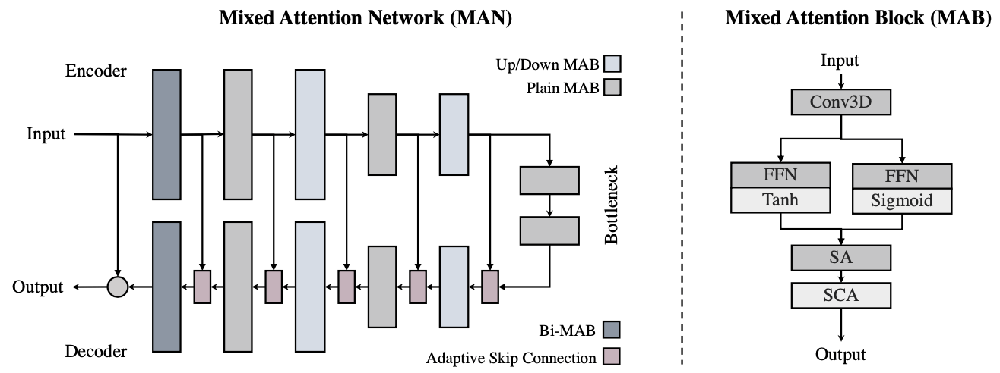

# MAN

PyTorch Implementation of [Mixed Attention Network for Hyperspectral Image Denoising]()

 

<br/>

🌟 **Hightlights**

- We propose a new adaptive skip connection which weights en-decoder features elementwise.
- We propose a lightweight mixed attention block with spectrum attention and channel attention.

## Usage

Download the pretrained model at [Github Release](https://github.com/Zeqiang-Lai/MAN/releases/latest).

- Training, testing, and visualize results with [HSIR](https://github.com/bit-isp/HSIR).

```shell
python -m hsirun.test -a mans.man -r ckpt/man_gaussian.pth -t icvl_512_30 icvl_512_50
python -m hsirun.train -a mans.man 
python -m hsiboard.app --logdir results
```

- Using our model.

```python
import torch
from mans import man

net = man()
x = torch.randn(4,1,31,64,64)
y = net(x)
```

- Using our components.

```python
import torch
from mans import (
    MAB, BiMAB,
    AdaptiveSkipConnection, SimplifiedChannelAttention,
)

x = torch.randn(4,16,31,64,64)
block = MAB(16) # or BiMAB(16)
out = block(x) # [4,16,31,64,64]

y = torch.randn(4,16,31,64,64)
block = AdaptiveSkipConnection(16)
out = block(x, y) # [4,16,31,64,64]

block = SimplifiedChannelAttention(16)
out = block(x) # [4,16,31,64,64]
```

## Performance

<details>
<summary>Gaussian denoising</summary>
 
</details>

<details>
<summary>Complex denoising</summary>
 

</details>


## Citations

```bibtex
@misc{lai_man2022,
    title={Mixed Attention Network for Hyperspectral Image Denoising}, 
    author={Zeqiang Lai, Ying Fu},
    year={2022},
}
```
