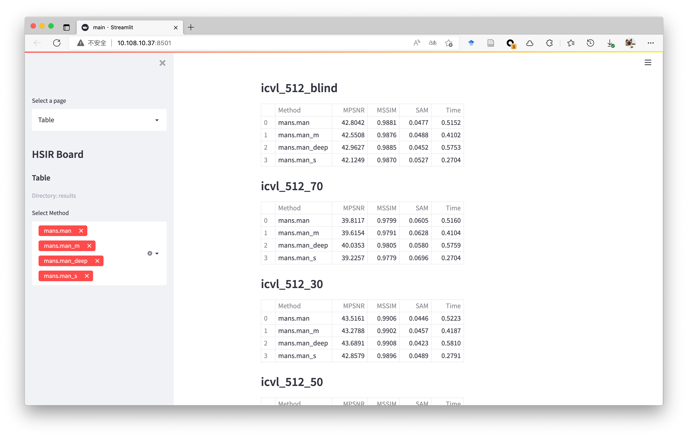
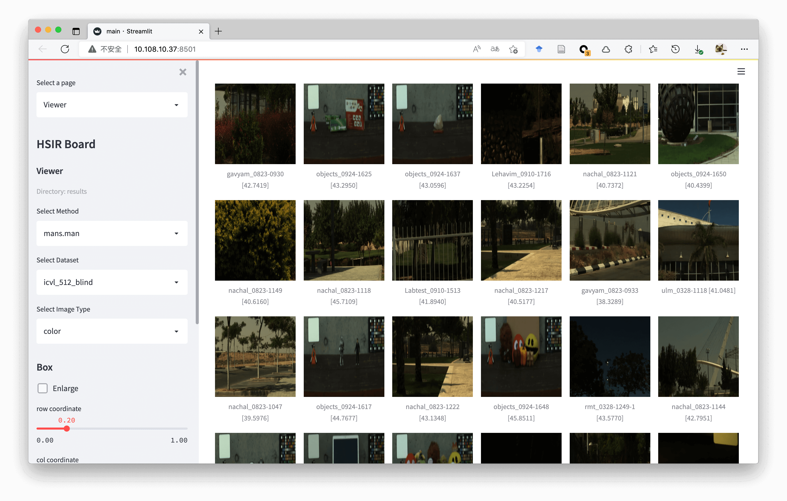
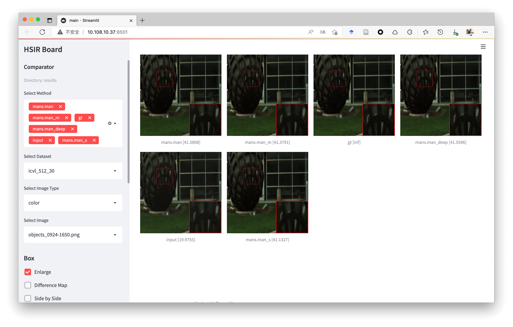

# Main Results

- Download the predicted images (simulated RGB and Gray of 20 th channel) from [Github Release]().

- Run by yourself,

```shell
sh results/test.sh
```

## HSIBoard

Visualize results with [HSIBoard](https://github.com/bit-isp/HSIR)

```shell
python -m hsiboard.app --logdir results
```





